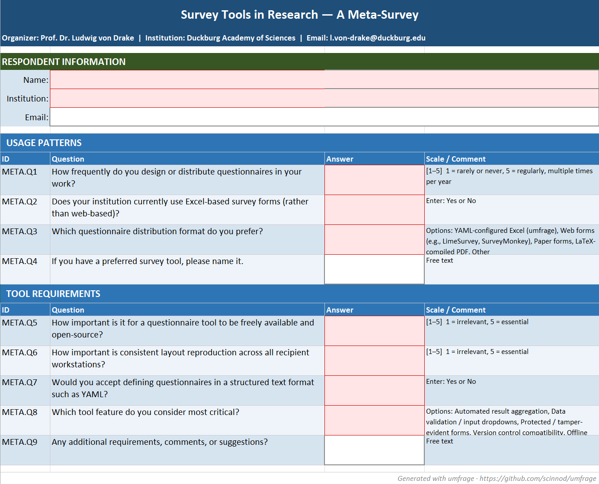
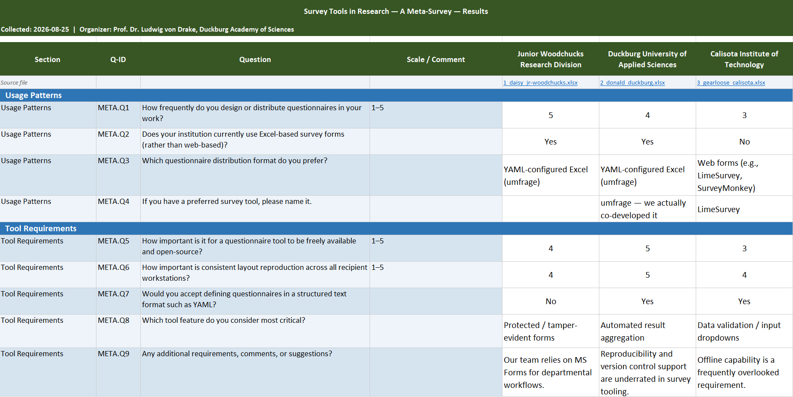

# umfrage

**umfrage** is a command-line tool for creating, distributing, and collecting
Excel-based questionnaires. Survey forms are defined in human-readable YAML
files and compiled into protected `.xlsx` files that can be emailed to
respondents. Returned files are validated and aggregated into a single result
spreadsheet.

Copyright 2024 David Kleinhans, Jade University of Applied Sciences, Oldenburg.
Licensed under the [Apache License 2.0](LICENSE).

---

## Features

- **Config-driven**: questionnaires are fully described in YAML — no code required
- **Protected Excel forms**: question cells are locked; only answer cells and
  respondent fields are editable; optional password protection
- **Data validation**: dropdown lists for scale (1–N), yes/no, and custom choices answers
- **Choices type**: user-defined dropdown options; reusable named lists via `choice_lists` in the YAML
- **Completeness check**: `umfrage validate` catches errors before generation
- **Config-free collection**: companion `*_metadata.yaml` embeds the full model
  so `umfrage collect` works without the original config file
- **Multi-questionnaire folders**: different questionnaires can coexist in the
  same response folder; one result file is produced per questionnaire
- **LLM authoring guide**: `docs/llm_guide.md` and `docs/questionnaire.schema.json`
  enable AI-assisted questionnaire authoring with IDE validation
- **Timestamped output files**: every `generate` run produces a new file
  (`{slug}_questionnaire_{YYYYMMDD_HHMMSS}.xlsx`) so old versions are never overwritten
- **Interactive invalid-file handling**: `collect` prompts per-file when validation
  fails; user can include (filling missing answers with a configurable marker),
  skip, or bulk-decide with *All* / *None*
- **Full test suite**: 228 unit tests via pytest (as of 2026-08-17)

---

## Installation

**Requirements:** Python 3.10+

```bash
# From the project root (inside the venv):
pip install -e .

# Including dev/test extras:
pip install -e ".[dev]"
```

Verify the installation:

```bash
umfrage --version
umfrage --help
```

---

## Quick Start

### 1. Author a questionnaire

Copy `config/questionnaire_sample.yaml` to `config/questionnaire.yaml`
(the working copy is gitignored) and edit it:

```bash
cp config/questionnaire_sample.yaml config/questionnaire.yaml
# Edit config/questionnaire.yaml in your editor
```

Add the following as the first line for IDE autocompletion (requires the
[YAML extension](https://marketplace.visualstudio.com/items?itemName=redhat.vscode-yaml)):

```yaml
# yaml-language-server: $schema=../docs/questionnaire.schema.json
```

See [docs/llm_guide.md](docs/llm_guide.md) for a full authoring guide
(especially useful when generating questionnaires with an AI assistant).

### 2. Validate the config

```bash
umfrage validate config/questionnaire.yaml
# [OK] 'config/questionnaire.yaml' is valid — 3 section(s), 9 question(s).
```

### 3. Generate the Excel file

```bash
umfrage generate config/questionnaire.yaml
# [OK] Questionnaire generated: ./annual-cooperation-survey-2024_questionnaire_20260812_143000.xlsx
# [OK] Metadata file written:   ./annual-cooperation-survey-2024_metadata_20260812_143000.yaml
```

Output filenames include a `YYYYMMDD_HHMMSS` timestamp so that re-generating
the questionnaire (e.g. after a config tweak) never overwrites an existing file.

By default a `*_metadata_{timestamp}.yaml` companion is also written.  Pass
`--no-metadata-file` to suppress it.  The metadata file embeds the full
questionnaire model so `umfrage collect` can run without the original
`questionnaire.yaml`.

Specify an output directory with `--output-dir`:

```bash
umfrage generate config/questionnaire.yaml --output-dir out/ --metadata-file
```

### 4. Distribute

Send `*_questionnaire_*.xlsx` to each institution. Keep the `*_metadata_*.yaml`
in your responses folder.

### 5. Collect and aggregate

Place all returned `.xlsx` files in a single folder (together with the
`*_metadata_*.yaml`), then run:

```bash
umfrage collect responses/
# [WARN] 'org_x.xlsx' failed validation:
#   • Required question 'S1.Q3' has no answer.
#   Include? [I]nclude / [S]kip / include [A]ll / skip [N]one [I]:
# [OK] 'Annual Cooperation Survey 2024': 5/5 included → responses/results_annual-...xlsx
```

For each file that fails validation you are asked what to do:

| Input | Effect |
|---|---|
| `I` or Enter (default) | Include the file; missing answers are filled with `XXXXX` (configurable) and highlighted |
| `S` | Skip the file |
| `A` | Include this and all remaining invalid files |
| `N` | Skip this and all remaining invalid files |

Pass `--skip-invalid` to suppress prompting and always skip invalid files
(useful for CI/CD pipelines).

The result file has:
- Row 1: questionnaire title
- Row 2: collection date and organizer info
- Row 4: column headers (Section | Q-ID | Question | Scale/Comment | Institution A | …)
- Subsequent rows: one per question; institution answers as columns
- Missing required answers are highlighted in the configured warning color
- Force-included missing answers show the `missing_answer_marker` (default `XXXXX`) also highlighted

---

## Examples

The `examples/` directory contains **"Survey Tools in Research — A Meta-Survey"** — a
self-contained demo questionnaire demonstrating all four answer types (`scale`,
`yes_no`, `choices`, `freetext`), `choice_lists`, and the full
generate → distribute → collect workflow with three pre-filled responses from
the Duckburg academic universe.

See [examples/README.md](examples/README.md) for details and instructions.





---

## CLI Reference

### `umfrage validate CONFIG`

Validate a questionnaire YAML config for syntax and completeness.

| Option | Description |
|---|---|
| `--style STYLE` | Path to `style.yaml`. Auto-detected from `style.yaml` in CWD, then `config/style.yaml`; falls back to built-in defaults. |

Exits with code **0** on success, **1** on error.

---

### `umfrage generate CONFIG`

Generate a protected Excel questionnaire from a YAML config.

| Option | Description |
|---|---|
| `--output-dir DIR` | Output directory (default: current directory) |
| `--style STYLE` | Path to `style.yaml` |
| `--no-metadata-file` | Skip writing the companion `*_metadata_*.yaml` file |

Output files always include a `YYYYMMDD_HHMMSS` timestamp in their names so
re-running `generate` never overwrites a previous result.

---

### `umfrage list RESPONSES_DIR`

List questionnaire groups found in a folder without processing them.

| Option | Description |
|---|---|
| `--config CONFIG` | Path to questionnaire YAML for resolving group titles and IDs |

Prints one row per questionnaire group with its **ID (slug)**, **title**,
**config hash prefix**, and **file count**.  Use the ID or hash prefix with
`umfrage collect --survey` to process only selected groups.

---

### `umfrage collect RESPONSES_DIR`

Collect and aggregate returned files into result spreadsheets.

| Option | Description |
|---|---|
| `--config CONFIG` | Path to questionnaire YAML (optional if `*_metadata_*.yaml` present) |
| `--style STYLE` | Path to `style.yaml` |
| `--output-dir DIR` | Output directory (default: same as `RESPONSES_DIR`) |
| `--skip-invalid` | Silently skip invalid files instead of prompting (CI-friendly) |
| `--survey TOKEN` | Process only the group matching TOKEN (slug or hash prefix ≥8 hex chars); repeat for multiple groups. Run `umfrage list` first to discover available IDs. Ignored when `--config` is given. |

When a response file fails validation the tool pauses and asks whether to
include or skip it.  Missing answers in force-included files are replaced by
the `missing_answer_marker` (default `XXXXX`) and highlighted.

Multiple questionnaires in one folder are handled automatically — one
`results_*.xlsx` is produced per questionnaire group found.  Use
`umfrage list` to preview groups and `--survey` to select a subset.

---

## Config File Reference

### questionnaire.yaml

See `config/questionnaire_sample.yaml` for a fully annotated template and
`docs/questionnaire.schema.json` for the JSON Schema.

**Top-level structure:**

```yaml
title: "Survey Title"
version: "1.0"

organizer:
  name: "Dr. Jane Smith"
  institution: "Research Institute"
  email: "j.smith@example.org"
  phone: "+1 555-0100"          # optional

respondent_fields:
  - label: "Name"
  - label: "Institution"     # used as column header in the result spreadsheet
  - label: "Email"
    required: false             # default: true

# TIP: include a field whose label contains "institution" or "organization".
# The collector uses it as the per-respondent column header in the result
# spreadsheet.  If no such field exists it falls back to the first field.

# Optional: define named option lists here and reference them with
# choices_ref: <name> in any choices-type question.
choice_lists:
  satisfaction_level:
    - "Very dissatisfied"
    - "Dissatisfied"
    - "Neutral"
    - "Satisfied"
    - "Very satisfied"

sections:
  - title: "Section Name"
    questions:
      - id: "S1.Q1"             # unique, slug-safe
        text: "Question text"
        answer:
          type: scale           # scale | yes_no | freetext | choices
          min_value: 1          # required for scale
          max_value: 5          # required for scale
          description: "1=poor, 5=excellent"  # optional hint
        comment: "Additional context"         # optional
        required: true          # default: true
```

**Answer types:**

| Type | Description | Excel behavior |
|---|---|---|
| `scale` | Integer in `[min_value, max_value]` | Whole-number data validation |
| `yes_no` | "Yes" or "No" | Dropdown list |
| `freetext` | Any text | No validation, open cell |
| `choices` | One of a user-defined option list | Dropdown list |

**Question ID rules:** alphanumeric, dots, hyphens, underscores; must start and
end with a letter or digit; globally unique across all sections.

---

### style.yaml

See `config/style.yaml` for a fully annotated template.

Key settings:

| Section | Controls |
|---|---|
| `header` | Title row colors and font |
| `section_header` | Section band row styling |
| `question_row` | Question cell styling and alternate row color |
| `answer_cell` | Answer cell styling (always white/unlocked) |
| `respondent_header` | "RESPONDENT INFORMATION" label row |
| `result_header` | Column headers in the result spreadsheet |
| `warning_color` | Background for missing/invalid required answer cells in results |
| `missing_answer_marker` | Text placed in missing-answer cells of force-included files (default: `XXXXX`) |
| `column_widths` | Character widths for ID, text, answer, comment columns |
| `protection_password` | Optional worksheet password (null = no password) |

All color values are 6-digit hex codes **without** a `#`.

---

## Project Structure

```
umfrage/
├── umfrage/
│   ├── cli.py            CLI entry point (validate, generate, collect, list)
│   ├── models.py         Pydantic domain models
│   ├── config_loader.py  YAML loading and Pydantic validation
│   ├── checker.py        Completeness checks (16 rules)
│   ├── generator.py      Excel questionnaire generation
│   ├── validator.py      Returned file validation
│   ├── collector.py      Multi-questionnaire aggregation
│   ├── translator.py     i18n string lookup
│   ├── styles.py         openpyxl styling helpers
│   └── i18n/             Translation files (en.yaml, de.yaml)
├── config/
│   ├── questionnaire_sample.yaml  Annotated template (tracked)
│   └── style.yaml                 Appearance config (tracked)
├── docs/
│   ├── llm_guide.md               AI/LLM authoring guide
│   └── questionnaire.schema.json  JSON Schema for IDE validation
├── tests/                         pytest test suite (228 tests, as of 2026-08-17)
├── pyproject.toml
├── COLLABORATORS.md               Project contributors
├── LICENSE                        Apache 2.0
└── CHANGELOG.md
```

---

## Development

Run the test suite:

```bash
pytest tests/ -v
```

With coverage:

```bash
pytest tests/ --cov=umfrage --cov-report=term-missing
```

---

## Contributing

1. Fork the repository.
2. Create a feature branch.
3. Add tests for new functionality.
4. Ensure `pytest tests/` passes without failures.
5. Run `umfrage validate config/questionnaire_sample.yaml` to confirm examples still work.
6. Open a pull request.

---

## License

Apache License 2.0 — see [LICENSE](LICENSE) for details.
